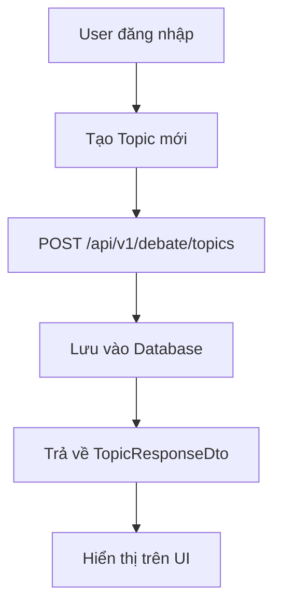
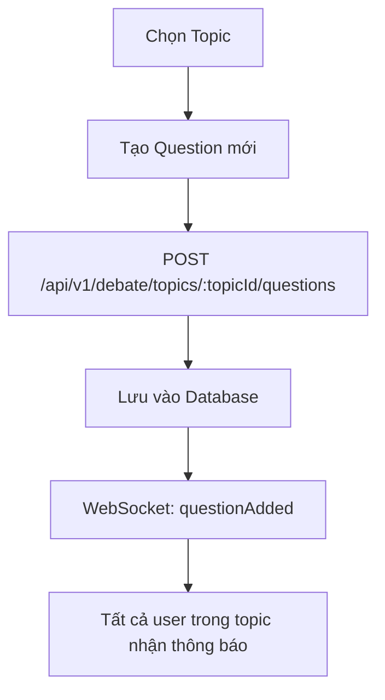
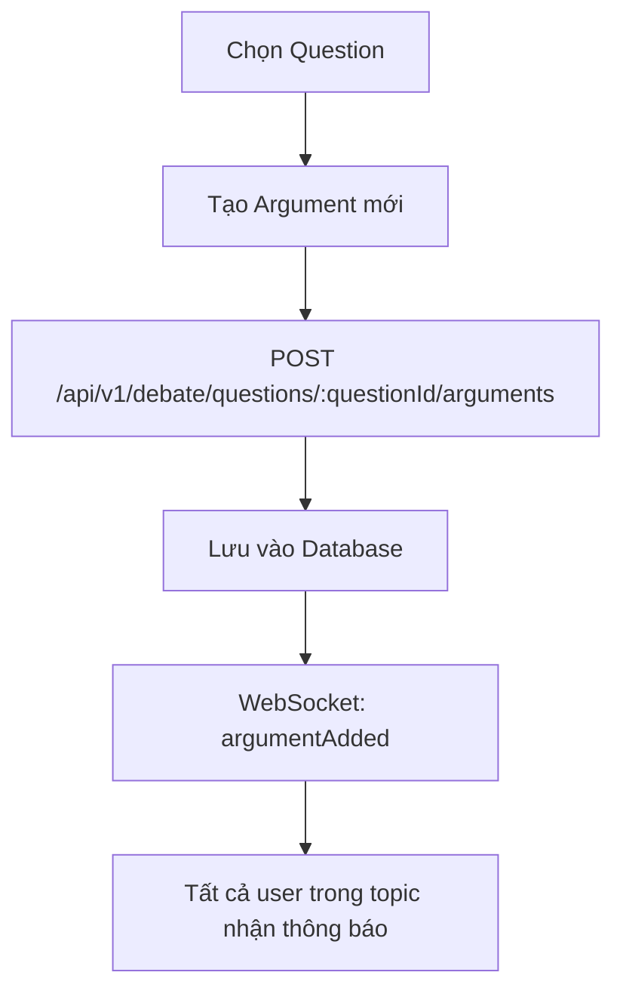
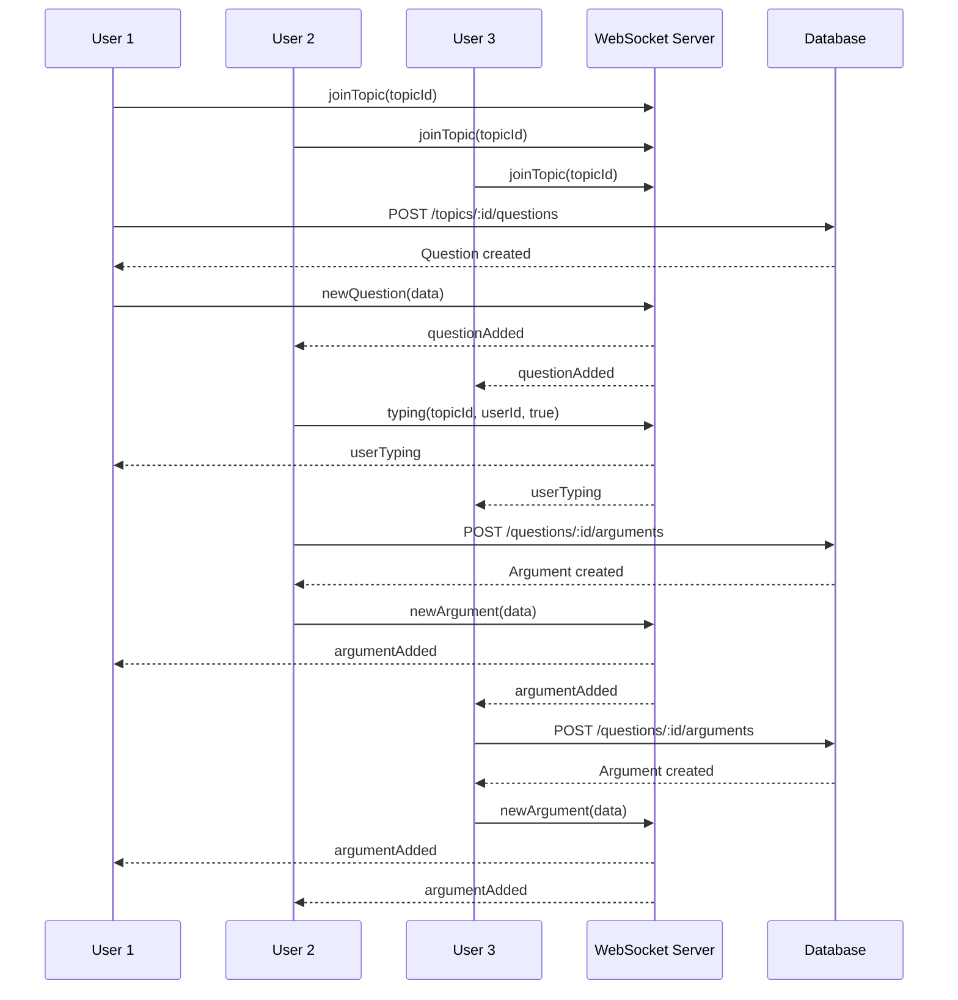

# Hệ thống Tranh luận - Luồng chức năng và Tương tác đa người dùng

## 📋 Tổng quan hệ thống

Hệ thống Debate được thiết kế theo mô hình **Domain-Driven Design (DDD)** với 3 thành phần chính:
- **Topic** (Chủ đề): Chủ đề tranh luận chính
- **Question** (Câu hỏi): Câu hỏi cụ thể trong chủ đề
- **Argument** (Luận điểm): Ý kiến, quan điểm về câu hỏi

## 🔄 Luồng chức năng chính

### 1. Tạo và Quản lý Chủ đề (Topic)



**API Endpoints:**
- `POST /api/v1/debate/topics` - Tạo chủ đề mới
- `GET /api/v1/debate/topics` - Lấy danh sách tất cả chủ đề
- `GET /api/v1/debate/topics/my` - Lấy chủ đề của tôi
- `GET /api/v1/debate/topics/:id` - Chi tiết chủ đề
- `PATCH /api/v1/debate/topics/:id` - Cập nhật chủ đề
- `DELETE /api/v1/debate/topics/:id` - Xóa chủ đề

### 2. Tạo và Quản lý Câu hỏi (Question)



**API Endpoints:**
- `POST /api/v1/debate/topics/:topicId/questions` - Tạo câu hỏi
- `GET /api/v1/debate/topics/:topicId/questions` - Lấy câu hỏi theo topic
- `GET /api/v1/debate/questions/:id` - Chi tiết câu hỏi
- `PATCH /api/v1/debate/questions/:id` - Cập nhật câu hỏi
- `DELETE /api/v1/debate/questions/:id` - Xóa câu hỏi

### 3. Tạo và Quản lý Luận điểm (Argument)



**API Endpoints:**
- `POST /api/v1/debate/questions/:questionId/arguments` - Tạo luận điểm
- `GET /api/v1/debate/questions/:questionId/arguments` - Lấy luận điểm theo câu hỏi
- `GET /api/v1/debate/arguments/my` - Lấy luận điểm của tôi
- `GET /api/v1/debate/arguments/:id` - Chi tiết luận điểm
- `PATCH /api/v1/debate/arguments/:id` - Cập nhật luận điểm
- `DELETE /api/v1/debate/arguments/:id` - Xóa luận điểm

## 🌐 Tương tác đa người dùng qua WebSocket

### Kết nối WebSocket

```javascript
// Frontend kết nối
const socket = io('ws://localhost:51213/debate', {
  auth: {
    token: 'jwt_token_here'
  }
});
```

### Các sự kiện WebSocket

#### 1. Tham gia/Rời khỏi Topic

```javascript
// Tham gia topic
socket.emit('joinTopic', { topicId: 'topic_id' });
socket.on('joinedTopic', (data) => {
  console.log('Đã tham gia topic:', data.topicId);
});

// Rời khỏi topic
socket.emit('leaveTopic', { topicId: 'topic_id' });
socket.on('leftTopic', (data) => {
  console.log('Đã rời khỏi topic:', data.topicId);
});
```

#### 2. Tạo câu hỏi mới (Real-time)

```javascript
// Gửi câu hỏi mới
socket.emit('newQuestion', {
  topicId: 'topic_id',
  question: { content: 'Nội dung câu hỏi' },
  userId: 'user_id'
});

// Nhận thông báo câu hỏi mới
socket.on('questionAdded', (data) => {
  console.log('Câu hỏi mới:', data.question);
  // Cập nhật UI hiển thị câu hỏi mới
});
```

#### 3. Tạo luận điểm mới (Real-time)

```javascript
// Gửi luận điểm mới
socket.emit('newArgument', {
  questionId: 'question_id',
  argument: { body: 'Nội dung luận điểm' },
  userId: 'user_id'
});

// Nhận thông báo luận điểm mới
socket.on('argumentAdded', (data) => {
  console.log('Luận điểm mới:', data.argument);
  // Cập nhật UI hiển thị luận điểm mới
});
```

#### 4. Trạng thái đang gõ (Typing Indicator)

```javascript
// Gửi trạng thái đang gõ
socket.emit('typing', {
  topicId: 'topic_id',
  userId: 'user_id',
  isTyping: true
});

// Nhận thông báo ai đang gõ
socket.on('userTyping', (data) => {
  console.log('User đang gõ:', data.userId, data.isTyping);
  // Hiển thị indicator đang gõ
});
```

## 🔄 Luồng tương tác đa người dùng

### Kịch bản: Nhiều user tranh luận về một chủ đề



### Các trường hợp sử dụng chính

#### 1. **Tranh luận nhóm**
- Nhiều user cùng tham gia một topic
- Mỗi user có thể tạo câu hỏi và luận điểm
- Tất cả user nhận thông báo real-time khi có nội dung mới

#### 2. **Thảo luận có cấu trúc**
- Topic → Questions → Arguments
- Dễ dàng theo dõi và quản lý cuộc thảo luận
- Có thể phân tích và đánh giá từng luận điểm

#### 3. **Tương tác real-time**
- Typing indicator cho biết ai đang gõ
- Thông báo ngay lập tức khi có nội dung mới
- Trải nghiệm mượt mà như chat

## 🛡️ Bảo mật và Phân quyền

### Authentication
- Tất cả API endpoints yêu cầu JWT token
- WebSocket connection cần xác thực

### Authorization
- **Topic**: Chỉ owner mới có thể update/delete
- **Question**: Mọi user đã xác thực có thể tạo/update/delete
- **Argument**: Chỉ author mới có thể update/delete

### Rate Limiting
- Giới hạn số lượng request per user
- Bảo vệ khỏi spam và abuse

## 📊 Monitoring và Analytics

### Metrics có thể theo dõi
- Số lượng topic/question/argument được tạo
- Số user active trong mỗi topic
- Thời gian phản hồi trung bình
- Tỷ lệ lỗi WebSocket connection

### Logs quan trọng
- User join/leave topic
- New question/argument created
- WebSocket connection/disconnection
- API errors và exceptions

## 🚀 Tối ưu hóa Performance

### Database
- Index trên các trường thường query (topicId, questionId, authorId)
- Pagination cho danh sách dài
- Caching cho dữ liệu ít thay đổi

### WebSocket
- Room-based broadcasting (chỉ gửi cho user trong topic)
- Connection pooling
- Heartbeat để detect disconnection

### Frontend
- Lazy loading cho danh sách dài
- Debounce cho typing indicator
- Optimistic updates cho UX tốt hơn

## 📱 Frontend Integration

### React/Next.js Example

```javascript
// Hook để quản lý debate
const useDebate = (topicId) => {
  const [questions, setQuestions] = useState([]);
  const [arguments, setArguments] = useState([]);
  const [typingUsers, setTypingUsers] = useState([]);

  useEffect(() => {
    // Kết nối WebSocket
    const socket = io('/debate');
    
    // Tham gia topic
    socket.emit('joinTopic', { topicId });
    
    // Lắng nghe events
    socket.on('questionAdded', (data) => {
      setQuestions(prev => [...prev, data.question]);
    });
    
    socket.on('argumentAdded', (data) => {
      setArguments(prev => [...prev, data.argument]);
    });
    
    socket.on('userTyping', (data) => {
      setTypingUsers(prev => {
        if (data.isTyping) {
          return [...prev.filter(u => u !== data.userId), data.userId];
        } else {
          return prev.filter(u => u !== data.userId);
        }
      });
    });

    return () => {
      socket.emit('leaveTopic', { topicId });
      socket.disconnect();
    };
  }, [topicId]);

  return { questions, arguments, typingUsers };
};
```

Hệ thống Debate được thiết kế để hỗ trợ tranh luận có cấu trúc, tương tác real-time và trải nghiệm người dùng mượt mà cho nhiều người tham gia cùng lúc.
