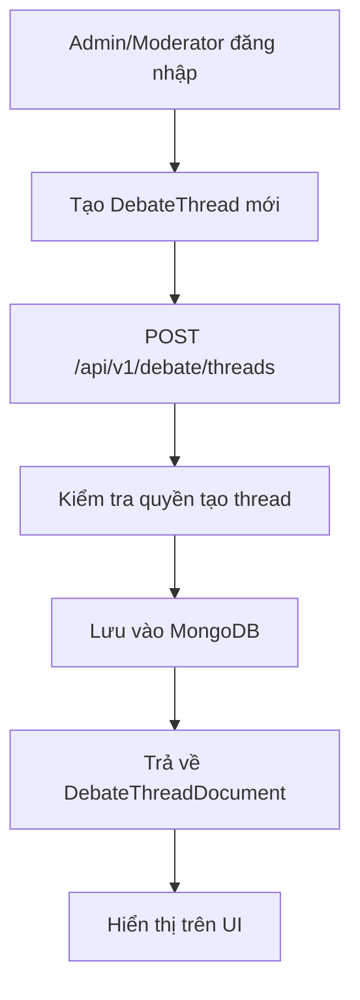
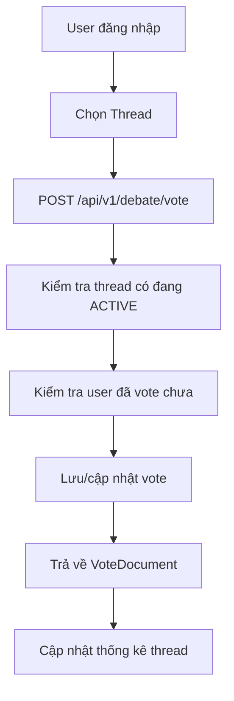
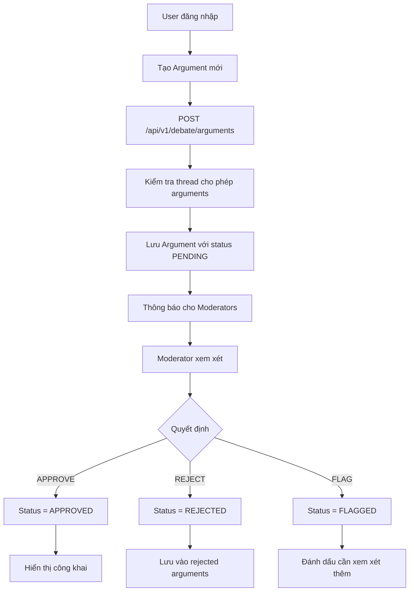
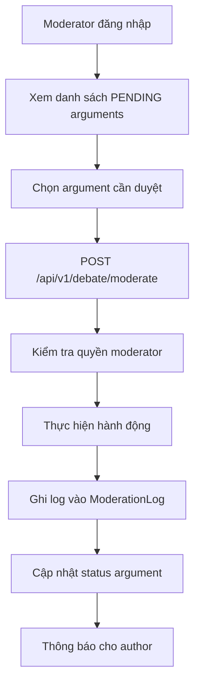
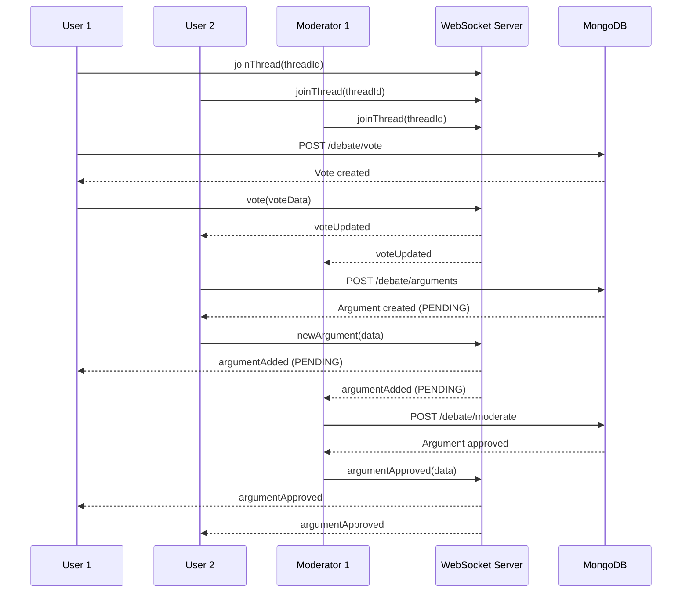
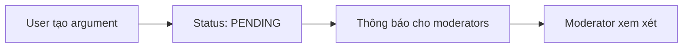
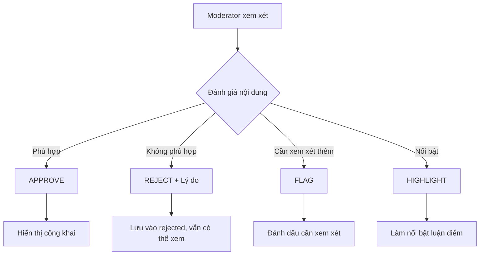

## Hệ thống Tranh luận – Main flow, chức năng và cách sử dụng

### Tổng quan nhanh
- Thực thể: `DebateThread`, `Vote`, `Argument`, `ModerationLog` (MongoDB/Mongoose).
- Phân quyền: `Admin` (duyệt ticket, gán 2 mod), `Moderator` (duyệt nội dung theo phân công), `User` (yêu cầu thread, vote, gửi luận điểm).
- Trạng thái Thread: `DRAFT` → `ACTIVE` → `PAUSED/CLOSED/ARCHIVED`.

### Main flows
1) Yêu cầu tạo Thread (ticket) → Admin duyệt, gán 2 Moderator (mỗi bên 1 mod)
   - User: `POST /api/v1/debate/threads/request` body: `{ title, description? }`
   - Admin: `POST /api/v1/debate/threads/:id/approve` body: `{ modForSideA, modForSideB }`
   - Kết quả: Thread chuyển `ACTIVE`, sẵn sàng vote/argument.

2) Tranh luận có kiểm duyệt (Arguments)
   - User gửi: `POST /api/v1/debate/arguments` (SUPPORT/OPPOSE/NEUTRAL). Nếu `requireModeration` → `PENDING`.
   - Moderator xem hàng chờ: `GET /api/v1/debate/moderation/queue`
   - Moderator hành động: `POST /api/v1/debate/moderate` (APPROVE/REJECT/FLAG/HIGHLIGHT/UNHIGHLIGHT)

3) Bình chọn (Voting)
   - `POST /api/v1/debate/vote` với `voteType: SUPPORT | OPPOSE` (chỉ khi thread `ACTIVE`).

4) Truy vấn
   - `GET /api/v1/debate/threads` – danh sách thread
   - `GET /api/v1/debate/threads/:id` – chi tiết thread
   - `GET /api/v1/debate/threads/:threadId/arguments` – danh sách luận điểm

### Cách sử dụng (cURL)
1) Đăng nhập Google (JWT)
```bash
curl -X POST -H "Content-Type: application/json" \
  -d '{"idToken":"<google_id_token>"}' \
  http://localhost:51213/api/v1/auth/google
```
Lưu `access_token` để dùng `Authorization: Bearer <token>`.

2) User gửi ticket tạo thread
```bash
curl -X POST \
  -H "Authorization: Bearer <token>" -H "Content-Type: application/json" \
  -d '{"title":"Tư tưởng Hồ Chí Minh trong giáo dục hiện đại"}' \
  http://localhost:51213/api/v1/debate/threads/request
```

3) Admin duyệt và gán 2 moderator
```bash
curl -X POST \
  -H "Authorization: Bearer <admin_token>" -H "Content-Type: application/json" \
  -d '{"modForSideA":"<modAUserId>","modForSideB":"<modBUserId>"}' \
  http://localhost:51213/api/v1/debate/threads/<threadId>/approve
```

4) User vote (emoji 👍/👎 → SUPPORT/OPPOSE)
```bash
curl -X POST \
  -H "Authorization: Bearer <token>" -H "Content-Type: application/json" \
  -d '{"threadId":"<threadId>","voteType":"SUPPORT"}' \
  http://localhost:51213/api/v1/debate/vote
```

5) User gửi luận điểm (PENDING nếu yêu cầu kiểm duyệt)
```bash
curl -X POST \
  -H "Authorization: Bearer <token>" -H "Content-Type: application/json" \
  -d '{
    "title":"Thực học gắn với hành",
    "content":"Đề cao giá trị đạo đức và năng lực thực tiễn",
    "threadId":"<threadId>",
    "argumentType":"SUPPORT"
  }' \
  http://localhost:51213/api/v1/debate/arguments
```

6) Moderator xem hàng chờ của mình
```bash
curl -H "Authorization: Bearer <mod_token>" \
  http://localhost:51213/api/v1/debate/moderation/queue
```

7) Moderator kiểm duyệt
```bash
curl -X POST \
  -H "Authorization: Bearer <mod_or_admin_token>" -H "Content-Type: application/json" \
  -d '{
    "argumentId":"<argumentId>",
    "moderatorId":"<modUserId>",
    "action":"APPROVE",
    "notes":"Phù hợp ngữ cảnh và dẫn chứng"
  }' \
  http://localhost:51213/api/v1/debate/moderate
```

# Hệ thống Tranh luận - Luồng chức năng và Tương tác đa người dùng

## 📋 Tổng quan hệ thống

Hệ thống Debate được thiết kế theo mô hình **MongoDB với Mongoose ODM** với 4 thành phần chính:
- **DebateThread** (Chủ đề tranh luận): Chủ đề tranh luận chính với hệ thống kiểm duyệt
- **Vote** (Bình chọn): Người dùng bình chọn ủng hộ/phản đối chủ đề
- **Argument** (Luận điểm): Ý kiến, quan điểm về chủ đề (có kiểm duyệt)
- **ModerationLog** (Nhật ký kiểm duyệt): Theo dõi tất cả hành động kiểm duyệt

## 🔄 Luồng chức năng chính

### 1. Tạo và Quản lý Chủ đề Tranh luận (DebateThread)



**API Endpoints:**
- `POST /api/v1/debate/threads` - Tạo chủ đề tranh luận mới (Admin/Moderator only)
- `GET /api/v1/debate/threads` - Lấy danh sách tất cả chủ đề
- `GET /api/v1/debate/threads/:id` - Chi tiết chủ đề
- `PUT /api/v1/debate/threads/:id/status` - Cập nhật trạng thái chủ đề

**Trạng thái Thread:**
- `DRAFT` - Nháp, chưa công khai
- `ACTIVE` - Đang hoạt động, cho phép bình chọn và luận điểm
- `PAUSED` - Tạm dừng
- `CLOSED` - Đã đóng
- `ARCHIVED` - Đã lưu trữ

### 2. Hệ thống Bình chọn (Voting)



**API Endpoints:**
- `POST /api/v1/debate/vote` - Bình chọn ủng hộ/phản đối
- `GET /api/v1/debate/threads/:threadId/votes` - Thống kê bình chọn
- `GET /api/v1/debate/threads/:threadId/my-vote` - Vote của user

**Loại Vote:**
- `SUPPORT` - Ủng hộ chủ đề
- `OPPOSE` - Phản đối chủ đề

### 3. Hệ thống Luận điểm với Kiểm duyệt (Argument)



**API Endpoints:**
- `POST /api/v1/debate/arguments` - Tạo luận điểm mới
- `GET /api/v1/debate/threads/:threadId/arguments` - Lấy luận điểm theo thread
- `GET /api/v1/debate/arguments/:id` - Chi tiết luận điểm
- `GET /api/v1/debate/threads/:threadId/rejected-arguments` - Xem luận điểm bị từ chối
- `GET /api/v1/debate/threads/:threadId/pending-arguments` - Xem luận điểm chờ duyệt

**Trạng thái Argument:**
- `PENDING` - Chờ kiểm duyệt
- `APPROVED` - Đã được duyệt, hiển thị công khai
- `REJECTED` - Bị từ chối, vẫn có thể xem để minh bạch
- `FLAGGED` - Được đánh dấu cần xem xét thêm

**Loại Argument:**
- `SUPPORT` - Luận điểm ủng hộ
- `OPPOSE` - Luận điểm phản đối
- `NEUTRAL` - Luận điểm trung lập

### 4. Hệ thống Kiểm duyệt (Moderation)



**API Endpoints:**
- `POST /api/v1/debate/moderate` - Thực hiện kiểm duyệt (Admin/Moderator only)
- `GET /api/v1/debate/moderation-logs` - Xem nhật ký kiểm duyệt

**Hành động Kiểm duyệt:**
- `APPROVE` - Duyệt luận điểm
- `REJECT` - Từ chối luận điểm (cần lý do)
- `FLAG` - Đánh dấu cần xem xét
- `HIGHLIGHT` - Làm nổi bật luận điểm
- `UNHIGHLIGHT` - Bỏ làm nổi bật

## 🌐 Tương tác đa người dùng qua WebSocket

### Kết nối WebSocket

```javascript
// Frontend kết nối
const socket = io('ws://localhost:51213/debate', {
  auth: {
    token: 'jwt_token_here'
  }
});
```

### Các sự kiện WebSocket

#### 1. Tham gia/Rời khỏi Thread

```javascript
// Tham gia thread
socket.emit('joinThread', { threadId: 'thread_id' });
socket.on('joinedThread', (data) => {
  console.log('Đã tham gia thread:', data.threadId);
});

// Rời khỏi thread
socket.emit('leaveThread', { threadId: 'thread_id' });
socket.on('leftThread', (data) => {
  console.log('Đã rời khỏi thread:', data.threadId);
});
```

#### 2. Bình chọn Real-time

```javascript
// Gửi vote
socket.emit('vote', {
  threadId: 'thread_id',
  voteType: 'SUPPORT', // hoặc 'OPPOSE'
  userId: 'user_id'
});

// Nhận thông báo vote mới
socket.on('voteUpdated', (data) => {
  console.log('Vote mới:', data.vote);
  // Cập nhật UI hiển thị thống kê vote
});
```

#### 3. Tạo luận điểm mới (Real-time)

```javascript
// Gửi luận điểm mới
socket.emit('newArgument', {
  threadId: 'thread_id',
  argument: { 
    title: 'Tiêu đề luận điểm',
    content: 'Nội dung luận điểm',
    argumentType: 'SUPPORT'
  },
  userId: 'user_id'
});

// Nhận thông báo luận điểm mới
socket.on('argumentAdded', (data) => {
  console.log('Luận điểm mới:', data.argument);
  // Cập nhật UI hiển thị luận điểm mới (status PENDING)
});
```

#### 4. Thông báo Kiểm duyệt

```javascript
// Nhận thông báo luận điểm được duyệt
socket.on('argumentApproved', (data) => {
  console.log('Luận điểm được duyệt:', data.argument);
  // Cập nhật UI hiển thị luận điểm đã duyệt
});

// Nhận thông báo luận điểm bị từ chối
socket.on('argumentRejected', (data) => {
  console.log('Luận điểm bị từ chối:', data.argument);
  // Hiển thị thông báo cho author
});
```

#### 5. Trạng thái đang gõ (Typing Indicator)

```javascript
// Gửi trạng thái đang gõ
socket.emit('typing', {
  threadId: 'thread_id',
  userId: 'user_id',
  isTyping: true
});

// Nhận thông báo ai đang gõ
socket.on('userTyping', (data) => {
  console.log('User đang gõ:', data.userId, data.isTyping);
  // Hiển thị indicator đang gõ
});
```

## 🔄 Luồng tương tác đa người dùng với Kiểm duyệt

### Kịch bản: Nhiều user tranh luận với hệ thống kiểm duyệt



### Các trường hợp sử dụng chính

#### 1. **Tranh luận có kiểm duyệt**
- User tạo luận điểm → Status PENDING
- Moderator xem xét và quyết định
- Luận điểm được duyệt → Hiển thị công khai
- Luận điểm bị từ chối → Vẫn có thể xem để minh bạch

#### 2. **Bình chọn công khai**
- User bình chọn ủng hộ/phản đối
- Thống kê real-time
- Mỗi user chỉ được vote 1 lần (có thể thay đổi)

#### 3. **Tương tác real-time**
- Typing indicator cho biết ai đang gõ
- Thông báo ngay lập tức khi có nội dung mới
- Thông báo trạng thái kiểm duyệt

#### 4. **Minh bạch và trách nhiệm**
- Tất cả luận điểm (kể cả bị từ chối) đều có thể xem
- Nhật ký kiểm duyệt đầy đủ
- Lý do từ chối được ghi rõ

## 🛡️ Bảo mật và Phân quyền

### Authentication
- Tất cả API endpoints yêu cầu JWT token
- WebSocket connection cần xác thực

### Authorization
- **DebateThread**: Chỉ Admin/Moderator có thể tạo
- **Vote**: Mọi user đã xác thực có thể vote
- **Argument**: Mọi user đã xác thực có thể tạo
- **Moderation**: Chỉ Admin/Moderator được chỉ định có thể kiểm duyệt

### Rate Limiting
- Giới hạn số lượng request per user
- Bảo vệ khỏi spam và abuse
- Giới hạn số luận điểm per user per thread

## 📊 Monitoring và Analytics

### Metrics có thể theo dõi
- Số lượng thread/argument/vote được tạo
- Số user active trong mỗi thread
- Thời gian kiểm duyệt trung bình
- Tỷ lệ luận điểm được duyệt/từ chối
- Thống kê vote theo thread

### Logs quan trọng
- User join/leave thread
- New vote/argument created
- Moderation actions và decisions
- WebSocket connection/disconnection
- API errors và exceptions

## 🚀 Tối ưu hóa Performance

### MongoDB
- Index trên các trường thường query (threadId, authorId, status)
- Pagination cho danh sách dài
- Aggregation pipeline cho thống kê
- Compound indexes cho queries phức tạp

### WebSocket
- Room-based broadcasting (chỉ gửi cho user trong thread)
- Connection pooling
- Heartbeat để detect disconnection
- Rate limiting cho events

### Frontend
- Lazy loading cho danh sách dài
- Debounce cho typing indicator
- Optimistic updates cho UX tốt hơn
- Cache cho dữ liệu ít thay đổi

## 📱 Frontend Integration

### React/Next.js Example

```javascript
// Hook để quản lý debate với kiểm duyệt
const useDebate = (threadId) => {
  const [thread, setThread] = useState(null);
  const [votes, setVotes] = useState({ support: 0, oppose: 0 });
  const [arguments, setArguments] = useState([]);
  const [pendingArguments, setPendingArguments] = useState([]);
  const [rejectedArguments, setRejectedArguments] = useState([]);
  const [typingUsers, setTypingUsers] = useState([]);

  useEffect(() => {
    // Kết nối WebSocket
    const socket = io('/debate');
    
    // Tham gia thread
    socket.emit('joinThread', { threadId });
    
    // Lắng nghe events
    socket.on('voteUpdated', (data) => {
      setVotes(data.votes);
    });
    
    socket.on('argumentAdded', (data) => {
      if (data.argument.status === 'PENDING') {
        setPendingArguments(prev => [...prev, data.argument]);
      }
    });
    
    socket.on('argumentApproved', (data) => {
      setArguments(prev => [...prev, data.argument]);
      setPendingArguments(prev => prev.filter(arg => arg.id !== data.argument.id));
    });
    
    socket.on('argumentRejected', (data) => {
      setRejectedArguments(prev => [...prev, data.argument]);
      setPendingArguments(prev => prev.filter(arg => arg.id !== data.argument.id));
    });
    
    socket.on('userTyping', (data) => {
      setTypingUsers(prev => {
        if (data.isTyping) {
          return [...prev.filter(u => u !== data.userId), data.userId];
        } else {
          return prev.filter(u => u !== data.userId);
        }
      });
    });

    return () => {
      socket.emit('leaveThread', { threadId });
      socket.disconnect();
    };
  }, [threadId]);

  return { 
    thread, 
    votes, 
    arguments, 
    pendingArguments, 
    rejectedArguments, 
    typingUsers 
  };
};
```

## 🔍 Tính năng Minh bạch

### 1. **Xem tất cả nội dung**
```javascript
// API để xem luận điểm bị từ chối
GET /api/v1/debate/threads/:threadId/rejected-arguments

// API để xem luận điểm chờ duyệt
GET /api/v1/debate/threads/:threadId/pending-arguments

// API để xem nhật ký kiểm duyệt
GET /api/v1/debate/moderation-logs?threadId=:threadId
```

### 2. **Lý do từ chối rõ ràng**
- Mỗi luận điểm bị từ chối đều có lý do cụ thể
- Ghi chú của moderator được lưu trữ
- Thời gian kiểm duyệt được ghi lại

### 3. **Thống kê công khai**
- Số lượng luận điểm được duyệt/từ chối
- Thời gian kiểm duyệt trung bình
- Tỷ lệ từ chối theo moderator

## 🎯 Quy trình Kiểm duyệt Chi tiết

### 1. **Luận điểm được tạo**


### 2. **Quyết định kiểm duyệt**


### 3. **Theo dõi và báo cáo**
- Nhật ký đầy đủ mọi hành động kiểm duyệt
- Thống kê hiệu suất moderator
- Báo cáo định kỳ về chất lượng nội dung

Hệ thống Debate được thiết kế để hỗ trợ tranh luận có cấu trúc, kiểm duyệt nghiêm ngặt, tương tác real-time và đảm bảo minh bạch hoàn toàn cho tất cả người tham gia.